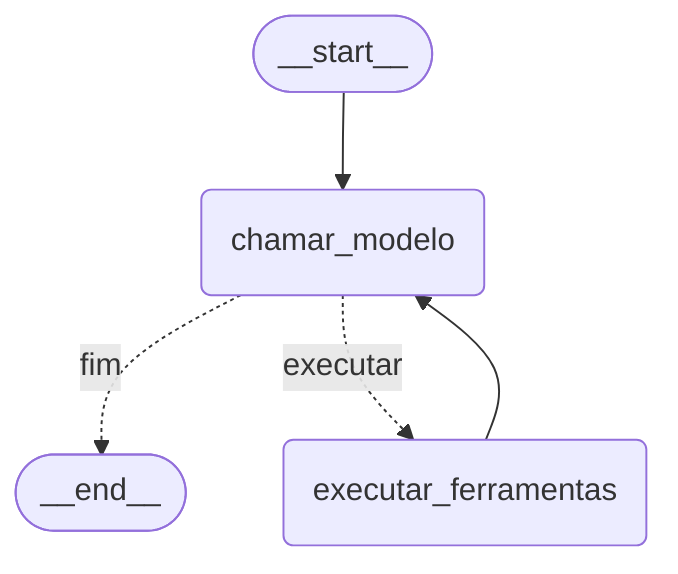
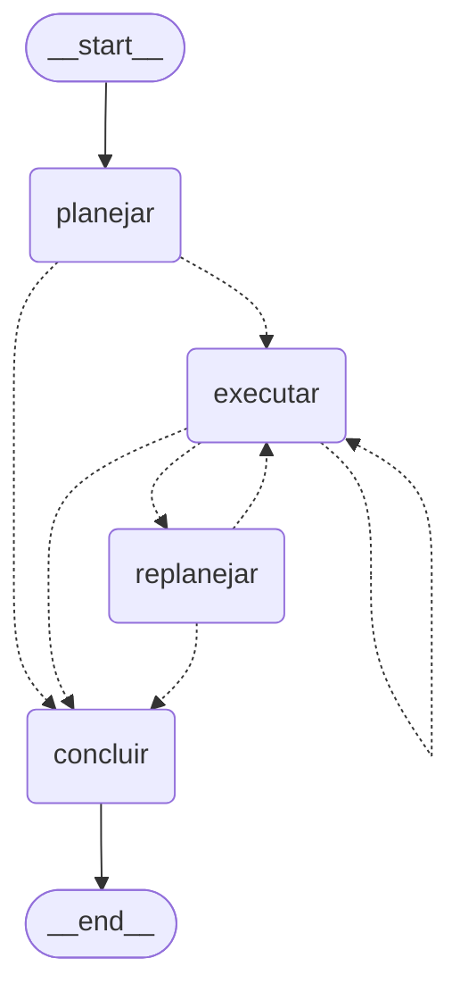

# Agente de reservas de viagem

O agente recebe um pedido de viagem em texto, com origem, destino, data e orçamento, e resolve
esse pedido chamando ferramentas: procura voos e hotéis no catálogo, cria a reserva, lista as
reservas de um usuário e cancela. O catálogo e as reservas ficam em um banco SQLite, e as
ferramentas alteram esse banco, então uma reserva ocupa um assento do voo e um cancelamento o
devolve. Cada execução parte de um banco limpo e imprime as chamadas que o modelo fez, o estado
do banco no fim e a resposta ao pedido.

O grafo do agente segue uma de duas estratégias, com as mesmas ferramentas e os mesmos prompts de
regra. Em `react`, o modelo escolhe a próxima chamada a cada turno. Em `plan-execute`, o modelo
escreve a lista de passos antes da primeira chamada, e cada passo é executado em seguida, com uma
revisão do plano quando uma busca volta vazia ou uma ferramenta devolve erro.

As ferramentas chegam ao agente por uma de duas fontes. Em `local`, o agente chama as funções no
processo. Em `mcp`, o agente lê o catálogo de um servidor MCP e chama as mesmas funções por esse
servidor. As duas fontes publicam os mesmos nomes, descrições e schemas, e gravam no mesmo banco.

O fluxo de reserva chega ao modelo por um de dois procedimentos. Em `prompt`, o fluxo está no
prompt de sistema. Em `skills`, o prompt de sistema traz o nome e a descrição da skill
`reservar-viagem`, e o modelo lê o fluxo pela ferramenta `read_skill` quando o pedido corresponde
à descrição. O texto do fluxo é o mesmo nos dois procedimentos.

## 1. Ambiente

O banco é criado em memória a cada execução, com três tabelas:

| Tabela | Representa | Colunas |
|---|---|---|
| `flights` | os voos à venda | `origin`, `destination`, `date`, `price`, `airline`, `seats` |
| `hotels` | os hotéis à venda | `city`, `name`, `stars`, `price_per_night` |
| `bookings` | as reservas | `user_id`, `kind`, `item_id`, `start_date`, `price`, `status` |

`flights` e `hotels` são o catálogo, semeado com as linhas de `domain/catalog.py` e igual em toda
execução. `bookings` começa vazia e recebe uma linha por reserva que o agente criar.

| Voo | Trecho | Data | Preço (EUR) | Assentos | Companhia |
|---|---|---|---|---|---|
| `FL-101` | MAD-LIM | 2026-09-12 | 980 | 4 | Iberia |
| `FL-102` | MAD-LIM | 2026-09-12 | 1240 | 9 | LATAM |
| `FL-103` | MAD-LIM | 2026-09-13 | 760 | 2 | Air France |
| `FL-201` | LIM-MAD | 2026-09-20 | 890 | 6 | Iberia |

| Hotel | Cidade | Nome | Estrelas | Preço por noite (EUR) |
|---|---|---|---|---|
| `HT-1` | LIM | Miraflores Suites | 4 | 120 |
| `HT-2` | LIM | Barranco Hostal | 2 | 45 |
| `HT-3` | LIM | Surco Business | 3 | 58 |

O agente altera as linhas de `bookings` e a coluna `flights.seats`. `create_booking` insere a
reserva com `status` em `confirmed` e decrementa o assento, e `cancel_booking` marca a linha como
`cancelled` e devolve o assento. As duas tabelas formam o snapshot que `state_hash` resume, e uma
execução que não escreva deixa o hash do início.

Quatro erros de reserva voltam sem alterar o banco: `flight_not_found` e `hotel_not_found` para
um `item_id` fora do catálogo, `no_seats_available` para um voo sem assento livre, e
`invalid_kind` para um `kind` diferente de `flight` e `hotel`.

## 2. Estrutura

```
src/travel_mas/
    domain/             catálogo, banco e regras de reserva
        catalog.py      esquema SQL, voos, hotéis, tabelas mutáveis
        database.py     TravelDB em memória, snapshot, hash e diff do estado
        operations.py   busca, criação, consulta e cancelamento
    runtime/            infraestrutura comum a qualquer agente
        context.py      provedor, modelo, limites do laço
        models.py       carga do cliente de chat
        workspace.py    banco e trace de uma execução
        runner.py       execução sobre banco limpo, com trace e snapshots
        messages.py     leitura das mensagens que o grafo devolve
        display.py      trajetória e tabelas em texto
        skills.py       leitura de SKILL.md, catálogo de skills e a ferramenta read_skill
    tools/              as ferramentas ligadas a um workspace
        search.py       as duas buscas de catálogo
        bookings.py     criação, consulta e cancelamento
        server.py       servidor MCP que publica as ferramentas locais
        remote.py       cliente MCP que adapta as ferramentas do servidor
    agents/             um pacote por agente
        travel/
            prompts.py  prompt de sistema e prompts do Plan-and-Execute
            tools.py    as ferramentas que este agente recebe
            state.py    estado de cada estratégia
            graph.py    montagem do agente e escolha da estratégia
            graphs/
                react.py         laço de ferramentas como StateGraph
                plan_execute.py  planejador, executor, replanejador e síntese
            skills/
                reservar-viagem/SKILL.md  o fluxo de reserva
    evaluation/         comparação de configurações
        compare.py      execução dos cenários por configuração
        report.py       tabela do relatório
    interfaces/
        mcp/            o servidor MCP publicado por stdio
    scenarios.py        os pedidos de demonstração
    cli.py              comandos
```

`agents/<nome>/tools.py` nomeia as ferramentas do agente, e `Toolbox.select()` troca cada nome
pelo objeto correspondente. Um nome que não esteja no `Toolbox` levanta `KeyError` na montagem
do grafo. Na fonte `mcp`, o `Toolbox` traz os nomes que o servidor publica em `list_tools`.

## 3. Instalação

O `uv` gerencia o interpretador, o ambiente e as dependências. O instalador está em
[docs.astral.sh/uv](https://docs.astral.sh/uv/getting-started/installation/):

```bash
curl -LsSf https://astral.sh/uv/install.sh | sh
```

`uv sync` lê `pyproject.toml` e `uv.lock`, cria `.venv/` na raiz do repositório e instala as
dependências, o pacote em modo editável e o grupo `dev`, com `pytest`, `ruff` e a CLI do
LangGraph. `.python-version` fixa o interpretador em 3.12, que o `uv` baixa quando não está na
máquina:

```bash
uv sync
```

Chave de API: copie `.env.example` para `.env` e preencha `OLLAMA_API_KEY`, gerada em
[ollama.com/settings/keys](https://ollama.com/settings/keys). O `.env` não é versionado, e o
`.env.example` traz o nome de cada variável do ambiente:

```bash
cp .env.example .env
```

O provedor Google fica em um extra, fora do conjunto padrão, e pede a chave `GOOGLE_API_KEY`,
gerada em [aistudio.google.com/apikey](https://aistudio.google.com/apikey). O Studio pede
`LANGSMITH_API_KEY`, gerada em
[smith.langchain.com/settings](https://smith.langchain.com/settings), e a CLI que o sobe está no
grupo `dev`:

```bash
uv sync --extra google
```

Uma chave exportada no terminal antes da execução tem precedência sobre o valor do `.env`, e
vale só na sessão do shell em que foi definida:

```bash
export OLLAMA_API_KEY=<chave>
```

Os comandos do pacote rodam de duas formas, e as seções seguintes assumem uma das duas. A
primeira é o prefixo `uv run`, que executa no ambiente do projeto sem ativação prévia e
sincroniza o `.venv/` antes da execução quando `pyproject.toml` ou `uv.lock` mudaram:

```bash
uv run python -m travel_mas catalogo
uv run pytest
```

A segunda é a ativação do `.venv/`, que põe `python`, `pytest` e `travel-mas` no `PATH` e
dispensa o prefixo. A ativação vale na sessão de terminal em que foi feita, e `deactivate` a
desfaz. Sem ela, `python -m travel_mas` termina em `command not found: python`, já que o macOS
traz `python3` no `PATH` e não `python`:

```bash
source .venv/bin/activate
python -m travel_mas catalogo
travel-mas catalogo
```

Sem instalar o pacote, `python main.py <comando>` acrescenta `src/` ao caminho de importação.

## 4. Execução

```bash
python -m travel_mas catalogo          # voos e hotéis do ambiente
python -m travel_mas cenarios          # lista os seis cenários
python -m travel_mas demo              # roda todos
python -m travel_mas demo 2 3          # roda os cenários 2 e 3
python -m travel_mas run "Reserve o voo MAD-LIM de 2026-09-12 por até 1000 EUR. Sou u-42."
python -m travel_mas comparar --modelo ollama --modelo google   # dois modelos lado a lado
python -m travel_mas --strategy plan-execute demo 2             # estratégia Plan-and-Execute
python -m travel_mas --tools mcp demo 2                         # ferramentas pelo servidor MCP
python -m travel_mas --procedure skills demo 2                  # fluxo lido da skill
```

Opções: `--provider ollama|google`, `--model <id>`, `--strategy react|plan-execute`,
`--tools local|mcp`, `--procedure prompt|skills`, `--max-steps <n>`, `--json`. As opções vêm
antes do comando. Sem `--strategy`, vale a variável `TRAVEL_STRATEGY`, e sem a variável, `react`.
Sem `--tools`, vale `TRAVEL_TOOLS`, e sem a variável, `local`. Sem `--procedure`, vale
`TRAVEL_PROCEDURE`, e sem a variável, `prompt`. Um valor desconhecido na opção é recusado pelo
parser, e na variável, pela montagem do agente, com a mensagem e o código de saída 2.

```bash
python -m travel_mas --provider google demo 1          # gemini-3.5-flash-lite
python -m travel_mas --provider google --model gemini-2.5-flash demo 1
```

Sem `--model` nem `TRAVEL_MODEL`, cada provedor usa o modelo de `DEFAULT_MODELS`: `gpt-oss:120b`
no Ollama e `gemini-3.5-flash-lite` no Google. `gemini` é aceito como nome do provedor Google. Os
parâmetros de amostragem que cada família aceita ficam em `runtime/models.py`.

A saída começa pela linha de configuração, com o provedor, o modelo, a estratégia, a fonte das
ferramentas e o procedimento:

```
CONFIGURAÇÃO  ollama:gpt-oss:120b | estratégia react | ferramentas mcp | procedimento prompt
```

Em seguida, cada execução traz a trajetória de chamadas, a tabela `bookings` resultante, os
assentos consumidos e a mensagem final. Na estratégia `plan-execute`, o bloco da execução começa
pelo plano, com a marca `(revisto pelo replanejador)` quando o plano foi reescrito durante a
execução, e traz depois da trajetória as chamadas que o executor recusou, quando houver. Com
`--json`, o JSON de cada execução traz a configuração no campo `config`, com `provider`, `model`,
`strategy`, `tool_source` e `procedure`.

### 4.1 Cenários

| # | Nome | Pedido |
|---|---|---|
| 1 | `voo-orcamento` | um voo, com duas opções na data e uma acima do teto de preço |
| 2 | `voo-e-hotel` | voo e hotel no mesmo pedido, com um teto para cada |
| 3 | `sem-disponibilidade` | uma data sem voo no catálogo |
| 4 | `fora-do-orcamento` | uma data com voo, e teto abaixo do preço da opção mais barata |
| 5 | `reserva-e-cancelamento` | reservar, listar e cancelar |
| 6 | `consulta-vazia` | um usuário sem reservas |

### 4.2 Comparação de configurações

Uma configuração reúne modelo, estratégia, fonte de ferramentas e procedimento. `comparar` roda
os cenários uma vez por configuração:

```bash
python -m travel_mas comparar --modelo ollama --modelo google
python -m travel_mas comparar --modelo ollama:gpt-oss:20b --modelo google 2 5
python -m travel_mas comparar --estrategia react --estrategia plan-execute
python -m travel_mas comparar --modelo ollama --modelo google \
    --estrategia react --estrategia plan-execute
python -m travel_mas comparar --ferramentas local --ferramentas mcp
python -m travel_mas comparar --procedimento prompt --procedimento skills
```

`--modelo` aceita `provedor` ou `provedor:modelo`, e se repete uma vez por modelo. A divisão
ocorre no primeiro dois-pontos, então `ollama:gpt-oss:20b` mantém o identificador inteiro. Sem
modelo, vale o padrão do provedor. `--estrategia` se repete uma vez por estratégia,
`--ferramentas`, uma vez por fonte, e `--procedimento`, uma vez por procedimento. Cada eixo sem a
opção usa o valor das opções globais.

Os valores dos quatro eixos se combinam entre si. O rótulo de cada coluna nomeia o que varia, na
ordem modelo, estratégia, fonte e procedimento, separados por `/`, como `react/skills` quando
variam a estratégia e o procedimento. Quando só o modelo varia, ou nada varia, o rótulo é o
modelo. A comparação pede ao menos duas configurações, e duas configurações com o mesmo rótulo são
recusadas.

O relatório traz uma linha por cenário e uma coluna por configuração, e a coluna `estado`. A célula
traz o tempo, o número de chamadas de ferramenta executadas e o número de chamadas ao modelo, lido
do campo `passos` do estado final. O total por configuração soma o tempo e as chamadas ao modelo:

```
  cenário                    react         plan-execute  estado
  -------------------------  ------------  ------------  ------
  1. voo-orcamento           2.4s / 3 / 4  3.8s / 3 / 5  igual
  2. voo-e-hotel             8.6s / 7 / 8  7.6s / 6 / 8  difere
```

`estado` compara o `state_hash` do banco no fim de cada execução. Duas configurações com o mesmo
hash deixaram o banco igual, por trajetórias que podem ter sido diferentes. Os cenários que
divergem saem listados com o hash de cada configuração. Uma configuração cujo grafo não monta, por
chave de API ausente, ocupa a coluna com `erro` e as demais continuam.

### 4.3 LangGraph Studio

```bash
langgraph dev
```

O comando sobe a API em `http://127.0.0.1:2024` e imprime o endereço do Studio, em
`https://smith.langchain.com/studio/?baseUrl=http://127.0.0.1:2024`. O grafo roda na máquina
local, e a interface é uma página servida pelo LangSmith, que pede conta e `LANGSMITH_API_KEY` no
`.env`. Com `LANGSMITH_TRACING=false`, as execuções não são enviadas ao LangSmith.

`langgraph.json` declara quatro grafos. `travel_agent` aponta para `make_graph`, com a estratégia
de `TRAVEL_STRATEGY`, a fonte de `TRAVEL_TOOLS` e o procedimento de `TRAVEL_PROCEDURE`.
`travel_agent_plan_execute` aponta para `make_plan_execute_graph`, `travel_agent_mcp`, para
`make_mcp_graph`, com as ferramentas do servidor MCP, e `travel_agent_skills`, para
`make_skills_graph`, com o fluxo lido da skill. Os quatro montadores criam o grafo sobre um
workspace novo. A chamada ao montador se repete a cada requisição, e cada execução do Studio parte
de um banco sem reservas.

O servidor guarda threads, checkpoints e store em `.langgraph_api/`, que o `.gitignore` cobre.
Apagar o diretório com o servidor parado descarta o histórico de threads do Studio, e o arranque
seguinte recria os arquivos:

```bash
rm -rf .langgraph_api/
```

### 4.4 Limitações do Ollama Cloud

O Ollama Cloud não aplica saídas estruturadas: o campo `format` da API de chat, com um JSON
Schema, não restringe a resposta do modelo. O planejador e o replanejador de `plan-execute`
declaram o esquema como ferramenta, pelo método `function_calling`, e o modelo o preenche ao chamar
essa ferramenta. Uma resposta que traz o esquema como texto, sem a chamada, não é aceita, e o
pedido se repete até 3 vezes antes do erro `o modelo não preencheu o esquema`.

O cliente do Ollama recebe `reasoning` com o nível de `Context.reasoning_effort`, `low` por
padrão. O `gpt-oss` ignora `think=false` e gera o raciocínio em cada chamada. Com o nível, o
cliente guarda o raciocínio da resposta, e no laço ReAct ele volta no histórico da chamada
seguinte. Com `reasoning=False`, o cliente descarta esse raciocínio, e parte das execuções do laço
termina com argumentos fora do pedido, como um `user_id` que o pedido não traz, ou com o erro 500
do Ollama Cloud. O planejador e o replanejador preenchem o esquema em uma chamada, fora do laço,
sobre uma cópia do cliente com `reasoning=False`, criada por `without_reasoning`. Um modelo do
Ollama sem a capacidade `thinking` recusa o nível com o erro 400
`"<modelo>" does not support thinking`.

## 5. Estado da execução

`TravelDB.snapshot()` devolve as tabelas mutáveis em ordem fixa, `state_hash()` reduz um
snapshot a 16 caracteres, e `diff_state()` lista as linhas acrescentadas, removidas e alteradas
entre dois snapshots.

`Workspace` reúne o banco e o trace de uma execução. `Workspace.reset()` troca o banco por um
limpo, e as ferramentas continuam ligadas ao mesmo objeto, então um grafo compilado roda vários
cenários sem herdar estado do anterior.

`arun_task` devolve `RunResult`, com os dois snapshots, o trace, a mensagem final, o tempo em
segundos e o campo `error` preenchido quando o agente levanta exceção. `RunResult.values` traz os
demais campos do estado final do grafo, como `passos` nas duas estratégias e `plano` em
`plan-execute`, e `--json` os imprime. `run_task` é o envoltório sincrônico, e as execuções de um
processo compartilham um laço de eventos só. Dentro de um laço já em execução, como uma célula de
notebook, use `await arun_task(...)`.

## 6. Ferramentas

| Ferramenta | Efeito |
|---|---|
| `search_flights`, `search_hotels` | leem o catálogo |
| `create_booking` | insere a reserva e decrementa o assento |
| `get_booking`, `list_bookings` | leem o estado mutável |
| `cancel_booking` | marca `cancelled` e devolve o assento |

Um erro de execução volta como dado (`{"error": "flight_not_found"}`) e chega ao modelo como
`ToolMessage`. Um erro passageiro do provedor consome até `Context.retry_attempts` tentativas, com
espera exponencial entre elas; esgotadas as tentativas, o erro entra em `RunResult.error` e os
cenários seguintes continuam. Cada requisição ao provedor espera até `Context.request_timeout`
segundos, 120 por padrão, e o prazo esgotado conta como erro passageiro.

### 6.1 Servidor MCP

`tools/server.py` monta um servidor MCP, com o `FastMCP` do SDK `mcp`, a partir das ferramentas
locais de um workspace. Cada ferramenta entra no servidor com o nome, a descrição e a função dela,
e o servidor deriva o schema de entrada da assinatura da função. O modelo recebe o mesmo schema
pelas duas fontes. O servidor roda a função em um thread de trabalho, fora do laço de eventos.

Com `--tools mcp`, `tools/remote.py` lê o catálogo do servidor por `list_tools` e cria uma
`StructuredTool` assíncrona por ferramenta publicada. Cada chamada abre uma sessão MCP por canais
em memória, no mesmo processo, e envia `call_tool`. O servidor fica ligado ao workspace da
execução, então o trace, os snapshots e o `state_hash` registram as chamadas feitas pelo servidor
como registram as locais.

Um argumento fora do schema volta do servidor com `isError`, sem entrada no trace. A ferramenta
adaptada põe o texto do servidor no campo `error` de um JSON, o formato dos erros de reserva, e o
modelo o recebe como `ToolMessage` com status `error`. Em `plan-execute`, esse retorno desvia ao
replanejador, como o erro de validação da ferramenta local. O texto difere entre as fontes: a
ferramenta local descreve a recusa com a mensagem do LangChain, e a fonte `mcp`, com a do servidor
(`Error executing tool ...`).

O mesmo servidor atende um host MCP externo por stdio:

```bash
python -m travel_mas.interfaces.mcp
```

Na configuração do host, a entrada roda o módulo pelo `uv`, com o caminho do repositório:

```json
{
  "mcpServers": {
    "travel-mas": {
      "command": "uv",
      "args": [
        "run", "--directory", "<repositório>",
        "python", "-m", "travel_mas.interfaces.mcp"
      ]
    }
  }
}
```

O processo cria um banco na partida. As reservas feitas pelo host ficam nesse banco até o processo
terminar, e o agente, em outro processo, não as lê.

## 7. Skills

Uma skill é um diretório em `agents/<nome>/skills/` com o arquivo `SKILL.md`: um frontmatter YAML
com `name` e `description`, e o corpo em markdown com os passos do procedimento. O campo `name`
repete o nome do diretório. O agente `travel` tem a skill `reservar-viagem`, cujo corpo é o fluxo
de reserva: buscar as opções, reservar a mais barata que cumpre a data e o orçamento, e confirmar
com `get_booking`.

```
---
name: reservar-viagem
description: >-
  Reserva de voos e hotéis: busca as opções, reserva a mais barata que cumpre a data e o
  orçamento do pedido e confirma o que ficou gravado. Aplica-se a todo pedido que peça para
  reservar um voo ou um hotel.
---

Fluxo de cada pedido:
1. Busque as opções com search_flights e search_hotels antes de afirmar ...
```

`--procedure` escolhe onde o corpo entra no contexto do modelo:

| Procedimento | Prompt de sistema | Ferramentas | Corpo da skill |
|---|---|---|---|
| `prompt` | fluxo e regras | as seis | no prompt de sistema |
| `skills` | lista de skills, instrução de leitura e regras | e `read_skill` | na `ToolMessage` |

`prompts.py` lê o corpo do `SKILL.md` na importação e o escreve no prompt do procedimento
`prompt`. Em `skills`, a leitura acrescenta uma chamada ao modelo e uma chamada de ferramenta ao
pedido que ativa a skill.

`read_skill(name)` devolve o corpo da skill, lido do disco a cada chamada, e registra a leitura na
trajetória, sem alterar o banco. Um nome fora do catálogo volta como
`{"error": "unknown_skill", "available": [...]}`. A ferramenta roda no processo com as duas fontes
de ferramentas.

Em `react`, `read_skill` é uma ferramenta como as outras. Em `plan-execute`, o nó `planejar`
chama antes o modelo com só `read_skill` ligada, e o corpo lido ocupa o lugar do fluxo no prompt
do planejador. Sem leitura, o planejador recebe o prompt sem o bloco do fluxo. `read_skill` fica
fora das ferramentas do executor.

## 8. Grafo

### 8.1 ReAct



As duas arestas tracejadas saem de `decidir_proximo_no`, que devolve `executar` enquanto a última
mensagem trouxer pedido de chamada e `passos` estiver abaixo de `max_steps`, e `fim` nos demais
casos. Ao atingir `max_steps`, a rota encerra o laço e a mensagem final sai vazia.

O estado tem `messages`, com o reducer `add_messages`, e `passos`, escrito pelo nó do modelo e
lido pela rota. O nó de ferramentas é um `ToolNode`. `passos` conta as chamadas de um pedido: o nó
do modelo o recomeça quando a última mensagem é do usuário, e numa thread do Studio cada pedido
parte do contador zerado.

### 8.2 Plan-and-Execute



| Nó | Chamada ao modelo | Escreve |
|---|---|---|
| `planejar` | esquema `Plano`, com as ferramentas no prompt | `plano` |
| `executar` | ferramentas ligadas, sobre o primeiro passo pendente | `evidencias`, `desvio` |
| `replanejar` | esquema `Replano`, com evidências e passos pendentes | `plano` |
| `concluir` | sem ferramentas, com o pedido e as evidências | a mensagem final |

Cada `Passo` do esquema tem dois campos, `ferramenta` e `descricao`, e o estado guarda o passo como
o texto `ferramenta: descricao`. O identificador no início do prefixo libera ao executor uma
ferramenta, e só ela é ligada ao modelo naquela chamada. Um nome citado na descrição não libera a
ferramenta citada. Um prefixo fora das ferramentas do agente não chama o modelo: a evidência do
passo é `{"error": "step_without_tool"}`, e a rota desvia ao replanejador.

O passo executa uma chamada. Um pedido a outra ferramenta volta como
`{"error": "tool_not_in_step"}`, e o segundo pedido da mesma resposta volta como
`{"error": "one_call_per_step"}`, os dois sem executar. O pedido recusado fica fora da trajetória,
que registra as chamadas executadas sobre o banco, e entra no campo `recusadas` do estado.

A evidência de um passo é o retorno das ferramentas que o executor chamou, ou o texto da resposta
quando nenhuma foi chamada. `desvio` fica verdadeiro quando uma busca de catálogo devolve lista
vazia ou um retorno traz o campo `error`. Depois de `executar`, a rota vai a `replanejar` na
primeira vez que `desvio` aparece. O replanejador troca os passos pendentes e mantém os
executados, e a lista vazia encerra o plano.

`passos` conta as chamadas ao modelo, como no laço ReAct. A rota manda o próximo passo ao executor,
ou o desvio ao replanejador, enquanto `passos` estiver abaixo de `max_steps`, e `concluir` roda
depois disso, com uma chamada a mais. O planejador e o replanejador preenchem o esquema pelo método
`function_calling`, com o cliente sem raciocínio descrito na seção 4.4. Uma resposta sem o esquema,
ou com campos fora dele, se repete até 3 vezes antes de o erro entrar em `RunResult.error`. Com o
procedimento `skills`, a leitura da skill em `planejar`, descrita na seção 7, conta como uma
chamada ao modelo.

O planejador, o executor e a síntese recebem o pedido atual precedido dos turnos anteriores da
conversa. Um turno anterior é uma mensagem do usuário e a última resposta do agente antes da
mensagem seguinte, e numa thread do Studio o segundo pedido chega ao planejador com o primeiro
turno.

O estado final chega à CLI em `RunResult.values`, com `plano`, `passos_feitos`, `evidencias`,
`recusadas`, `desvio` e `replanejado`.

## 9. Referências

- LangGraph: https://docs.langchain.com/oss/python/langgraph/overview
- Ferramentas no LangChain: https://docs.langchain.com/oss/python/langchain/tools
- Padrões multiagente: https://docs.langchain.com/oss/python/langchain/multi-agent/index
- Subagents: https://docs.langchain.com/oss/python/langchain/multi-agent/subagents
- Ollama Cloud: https://docs.ollama.com/cloud
- Model Context Protocol: https://modelcontextprotocol.io
- SDK Python do MCP: https://github.com/modelcontextprotocol/python-sdk
- Agent Skills: https://platform.claude.com/docs/en/agents-and-tools/agent-skills/overview
